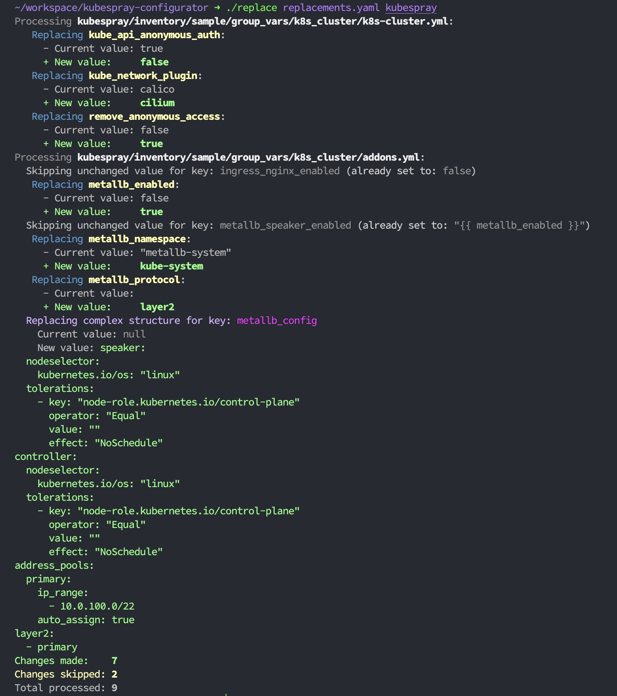
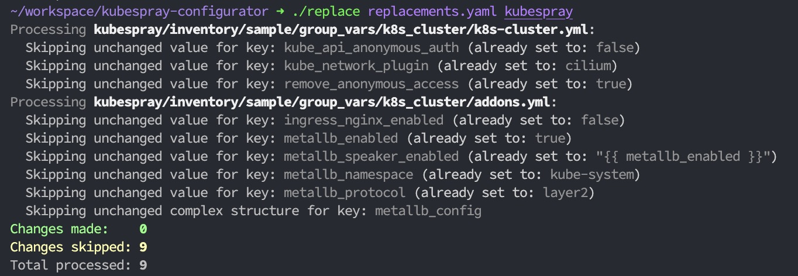

# 🔨 Kubespray Configuration Manager

> This is a tool to help you maintain your settings for kubespray.

When iterating on your kubespray configuration, you often need to change the same settings in multiple places.

This tool helps you _better_ manage these settings by performing the replacements in a single command.

Pass in a yaml file to define the settings you want to change, and a directory to store the files you want to change. It then replaces the values in the files with the new values. 👏👏👏

## Usage

```bash
./replace ../configs/version-1.yaml ~/workspace/foo/kubespray
```



